# Microsoft SQL Server (T-SQL) Learning Path

Welcome to the **Microsoft SQL Server (T-SQL) Learning Path** repository! This repository serves as a structured collection of notes, examples, and exercises designed to guide you through the fundamentals and advanced concepts of Transact-SQL (T-SQL).

Whether you're a beginner taking your first steps into SQL Server or an experienced professional looking to refresh your knowledge, this resource aims to provide clear, concise, and practical insights into T-SQL programming.

```mermaid
mindmap
  root((T-SQL Learning))
    Fundamentals
      System Data Types
        Exact Numerics
          bit
          INT
          BIGINT
          SMALLINT
          TINYINT
          DECIMAL
          FLOAT
        Approximate Numerics
          REAL
        Character
          CHAR
          VARCHAR
          NCHAR
          NVARCHAR
          TEXT
        Date and Time
          DATE
          DATETIME
          DATETIME2
          SMALLDATETIME
          TIME
        Binary
          BINARY
          VARBINARY
          IMAGE
        Other
          BIT
          UNIQUEIDENTIFIER
          SQL_VARIANT
      Operators
        Arithmetic
          Plus
          Minus
          Multiply
          Divide
          Modulo
        Comparison
          Equal
          Not Equal
          Not Equal Alt
          Greater Than
          Less Than
          Greater or Equal
          Less or Equal
        Logical
          AND
          OR
          NOT
        Bitwise
          Bitwise AND
          Bitwise OR
          Bitwise XOR
          Bitwise NOT
      Variables
        Declaration
          DECLARE
        Initialization
          SET
          SELECT
        Scope
          Local
          Global via temp tables or context
      Control Flow
        IF ELSE
        CASE
        WHILE
        BREAK
        CONTINUE
        RETURN
        GOTO
      Comments
        Single-line comment
        Multi-line comment

    Data Definition Language
      CREATE
        Create Database
        Create Table
        Create Index
        Create View
        Create Procedure
        Create Function
        Create Trigger
      ALTER
        Alter Database
        Alter Table
        Alter Index
        Alter View
        Alter Procedure
        Alter Function
        Alter Trigger
      TRUNCATE
        Truncate Table
      DROP
        Drop Database
        Drop Table
        Drop Index
        Drop View
        Drop Procedure
        Drop Function
        Drop Trigger

    Data Manipulation Language
      SELECT Statement
        Select Columns
        From Clause
        Where Clause
        Order By
        Group By
        Having
        Distinct
        Aliases
      INSERT Statement
        Insert Values
        Insert from Select
        Default Values
      UPDATE Statement
        Set Clause
        Where Clause
      DELETE Statement
        From Clause
        Where Clause
      MERGE Statement
        Merge Into
        Using Clause
        When Matched
        When Not Matched
        Output Clause

    Functions
      Built-in Functions
        String Functions
          LEN
          LEFT
          RIGHT
          CHARINDEX
          REPLACE
          LOWER
          UPPER
          LTRIM
          RTRIM
        Date Functions
          GETDATE
          DATEADD
          DATEDIFF
          CONVERT
          FORMAT
        Mathematical Functions
          ABS
          CEILING
          FLOOR
          ROUND
          POWER
          SQRT
        Aggregate Functions
          COUNT
          SUM
          AVG
          MIN
          MAX
        System Functions
          System Variable: IDENT_CURRENT
          SCOPE_IDENTITY
          ISNULL
          COALESCE
          CAST
          CONVERT
      User-defined Functions
        Scalar Functions
          Returns single value
        Table-valued Functions
          Inline Table-valued
          Multi-statement Table-valued

    Stored Procedures
      Create Procedure
      Execute Procedure
        EXEC
        EXECUTE
        With Parameters
      Alter Procedure
      Drop Procedure

    Views
      Create View
        With Encryption
        With Schema Binding
        With Check Option
      Types of Views
        Simple View
        Complex View
        Indexed View
        Partitioned View

    Transactions
      Begin Transaction
      Commit Transaction
      Rollback Transaction
      Save Transaction
      ACID Properties
        Atomicity
        Consistency
        Isolation
        Durability

    Joins
      Inner Join
      Left Join
      Right Join
      Full Outer Join
      Cross Join
      Self Join
      APPLY Operator
        Cross Apply
        Outer Apply

    Subqueries
      Types
        Scalar Subquery
        Table Subquery
      IN Operator
      EXISTS Operator
      Correlated Subquery
      Subquery in From Clause

    Common Table Expressions
      With Clause
      Recursive CTEs
        Anchor Member
        Recursive Member
        Termination Condition
      Multiple CTEs
      Use with Insert Update Delete

    Performance Tuning
      Indexing
        Clustered Index
        Non-clustered Index
        Unique Index
        Filtered Index
        Columnstore Index
        Covering Index
        Included Columns
      Query Optimization
        Execution Plan
          Actual Plan
          Estimated Plan
        Statistics
          Auto Update Statistics
        SET Options
          Set Statistics IO
          Set Statistics TIME

    Database Maintenance
      DBCC Commands
        DBCC CheckDB
        DBCC CheckTable
        DBCC ShowContig (deprecated)
        DBCC ShrinkDatabase
        DBCC ShrinkFile
        DBCC FreeProcCache
        DBCC DropCleanBuffers
        DBCC CheckIdent

```



## Module Objective

The primary objective of this learning path is to provide a comprehensive and practical guide to T-SQL, enabling learners to:

* **Understand Core Concepts:** Grasp the foundational building blocks of SQL Server, including data types, operators, and control flow.
* **Master Data Manipulation:** Learn to effectively query, insert, update, and delete data using DML statements.
* **Design and Manage Databases:** Gain proficiency in DDL statements for creating and altering database objects.
* **Develop Advanced Querying Skills:** Explore complex topics like functions, stored procedures, views, joins, subqueries, and Common Table Expressions (CTEs).
* **Optimize Performance:** Understand indexing and query optimization techniques to write efficient T-SQL code.
* **Perform Database Maintenance:** Learn essential DBCC commands for maintaining SQL Server databases.

## Learning Outcomes

By the end of this learning path, you will be able to:

1.  **Write robust T-SQL queries** for data retrieval, manipulation, and definition.
2.  **Design and implement efficient database objects** (tables, views, procedures, functions).
3.  **Troubleshoot and optimize SQL queries** for improved performance.
4.  **Understand best practices** for T-SQL development and database maintenance.
5.  **Confidently work with Microsoft SQL Server** in various development and administrative roles.

## Repository Structure

This repository is organized into logical modules and sub-topics, making it easy to navigate and find specific information.

```text

Microsoft-SQL/
├── .gitignore                            \# Git ignore file for common SQL/OS temporary files
├── README.md                             \# This README file
├── fundamentals/
│   ├── 01_data_types.md                  \# Explanation of all T-SQL system data types
│   ├── 02_operators.md                   \# Details on arithmetic, comparison, logical, and bitwise operators
│   ├── 03_variables_and_control_flow.md  \# Guide to variables (DECLARE, SET, SELECT) and control flow (IF/ELSE, CASE, WHILE, BREAK, CONTINUE, RETURN, GOTO)
│   └── 04_comments.md                    \# How to use single-line and multi-line comments for documentation
├── ddl/
│   └── ddl_statements.md                 \# Data Definition Language: CREATE, ALTER, TRUNCATE, DROP for various objects
├── dml/
│   └── dml_statements.md                 \# Data Manipulation Language: SELECT, INSERT, UPDATE, DELETE, MERGE
├── functions/
│   ├── built_in_functions.md             \# Comprehensive guide to SQL Server's built-in functions (string, date, math, aggregate, system)
│   └── user_defined_functions.md         \# Creating scalar and table-valued user-defined functions
├── procedures/
│   └── stored_procedures.md              \# Creating, executing, altering, and dropping stored procedures
├── views/
│   └── views.md                          \# Working with views, including options like WITH ENCRYPTION, SCHEMABINDING, and CHECK OPTION
├── transactions/
│   └── transactions.md                   \# Understanding BEGIN/COMMIT/ROLLBACK TRANSACTION and ACID properties
├── joins/
│   └── joins.md                          \# Detailed explanation of INNER, LEFT, RIGHT, FULL OUTER, CROSS, SELF joins, and APPLY operator
├── subqueries/
│   └── subqueries.md                     \# Types of subqueries, IN/EXISTS operators, correlated subqueries
├── cte/
│   └── common_table_expressions.md       \# Guide to Common Table Expressions, including recursive CTEs
├── performance_tuning/
│   ├── indexing.md                       \# Comprehensive overview of various index types and their usage
│   └── query_optimization.md             \# Techniques for optimizing query performance, execution plans, and statistics
└── database_maintenance/
└── dbcc_commands.md                      \# Essential DBCC commands for database health and management

````

## Reference Materials

Each module and sub-topic will contain its own specific reference materials. However, here are some general highly recommended resources for T-SQL:

### Books

* **T-SQL Fundamentals** by Itzik Ben-Gan (Microsoft Press)
* **SQL Server 2019 Revealed: A Guide to the Latest Features and Enhancements** by Bob Ward (Microsoft Press)
* **Pro T-SQL 2022** by Louis Davidson and Kevin Boles (Apress)

### Online Resources

* **Microsoft Learn - SQL Server Documentation**: The official and most authoritative source for T-SQL ([https://learn.microsoft.com/en-us/sql/](https://learn.microsoft.com/en-us/sql/))
* **SQLShack**: A great resource for articles, tutorials, and practical examples on SQL Server ([https://www.sqlshack.com/](https://www.sqlshack.com/))
* **SQL Performance**: Blog by Grant Fritchey, focused on SQL Server performance tuning ([https://www.sqlperformance.com/](https://www.sqlperformance.com/))
* **Stack Overflow**: For specific questions and troubleshooting ([https://stackoverflow.com/questions/tagged/sql-server](https://stackoverflow.com/questions/tagged/sql-server))

## Tools

To follow along with the examples and complete the practical tasks, you will need:

* **SQL Server Management Studio (SSMS)**: The primary tool for managing SQL Server instances and databases.
* **Azure Data Studio**: A cross-platform database tool for data professionals using the Microsoft family of on-premises and cloud data platforms.
* **A running SQL Server Instance**: This can be SQL Server Developer Edition (free), SQL Server Express (free, limited features), or a SQL Server instance hosted in Azure (e.g., Azure SQL Database).

## How to Use This Repository

1.  **Clone the Repository**:
    ```bash
    git clone [https://github.com/andikatjacobdennis/Microsoft-SQL.git](https://github.com/andikatjacobdennis/Microsoft-SQL.git)
    cd Microsoft-SQL
    ```
2.  **Navigate Through Modules**: Start with the `fundamentals` directory and proceed through the `01_data_types.md`, `02_operators.md`, etc., files.
3.  **Read and Understand**: Each `.md` file contains detailed explanations, syntax, and examples.
4.  **Practice Hands-On**: Utilize the "Lab Exercises / Hands-On Practice" sections within each `.md` file to apply what you've learned. Run the SQL code in SSMS or Azure Data Studio.
5.  **Self-Assess**: Use the "Assessments" section (MCQs and Short Answer Questions) to test your understanding.
6.  **Review Practical Tasks**: Complete the "Practical Task" at the end of each module to consolidate your knowledge.

## Contribution

This repository is intended to be a living document. If you find any errors, have suggestions for improvement, or would like to contribute additional content (e.g., more examples, advanced topics, lab solutions), please feel free to:

1.  **Fork** the repository.
2.  **Create a new branch** (`git checkout -b feature/your-feature-name`).
3.  **Make your changes**.
4.  **Commit** your changes (`git commit -m 'Add new feature'`).
5.  **Push** to your branch (`git push origin feature/your-feature-name`).
6.  **Open a Pull Request**.

## License

This project is licensed under the MIT License - see the [LICENSE](LICENSE) file for details.
